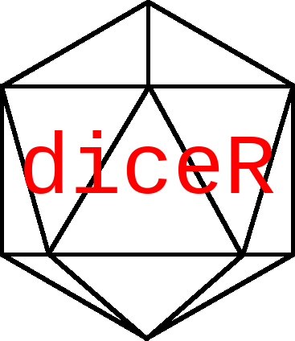

<!-- README.md is generated from README.Rmd. Please edit that file -->

```{r, include = FALSE}
knitr::opts_chunk$set(
  collapse = TRUE,
  comment = "#>",
  fig.path = "man/figures/README-",
  out.width = "100%"
)
```

# diceR 

<!-- badges: start -->
<!-- badges: end -->

The `diceR` package is a demo for the [Translational Bioinformatics Workshop](https://github.com/Bin-Chen-Lab/translational_bioinformatics_workshop).

This is an unordered list of dice shapes:

- cubes
- tetrahedra
- icoshedra


## Installation

Use the `remotes` package to install from GitHub.

``` r
if (!require(remotes))
  install.packages("remotes")

remotes::install_github("pegeler/diceR")
```

## Example

This is a basic example which shows you how to solve a common problem:

```{r example}
library(diceR)

# Roll two dice both with six faces
2 %d% 6

# Another way to do the same thing
dice("2d6")
```

