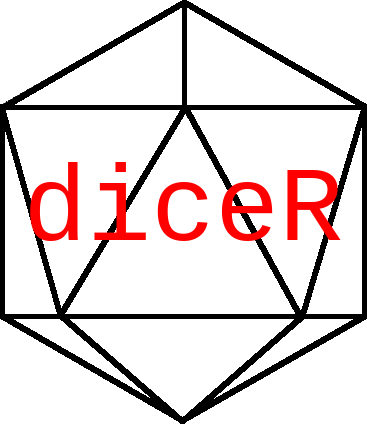

<!-- README.md is generated from README.Rmd. Please edit that file -->

# diceR 

<!-- badges: start -->

<!-- badges: end -->

The `diceR` package is a demo for the [Translational Bioinformatics
Workshop](https://github.com/Bin-Chen-Lab/translational_bioinformatics_workshop).

This is an unordered list of dice shapes:

  - cubes
  - tetrahedra
  - icoshedra

## Installation

Use the `remotes` package to install from GitHub.

``` r
if (!require(remotes))
  install.packages("remotes")

remotes::install_github("pegeler/diceR")
```

## Example

This is a basic example which shows you how to solve a common problem:

``` r
library(diceR)

# Roll two dice both with six faces
2 %d% 6
#> You rolled... 7 : 2 5

# Another way to do the same thing
dice("2d6")
#> You rolled... 6 : 3 3
```
